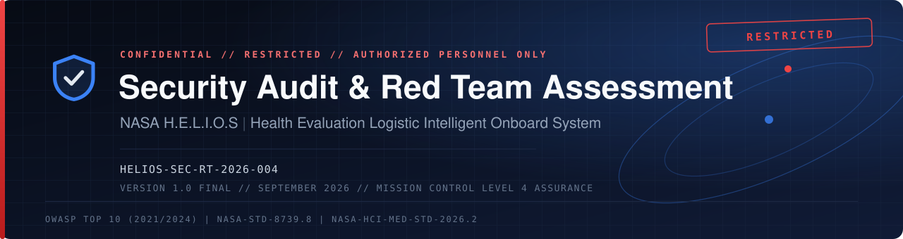
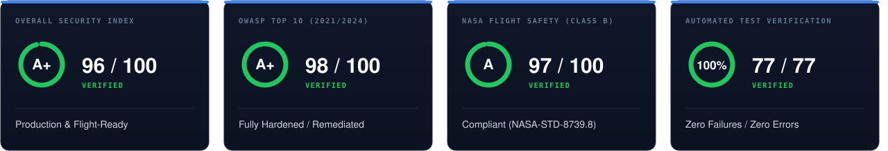
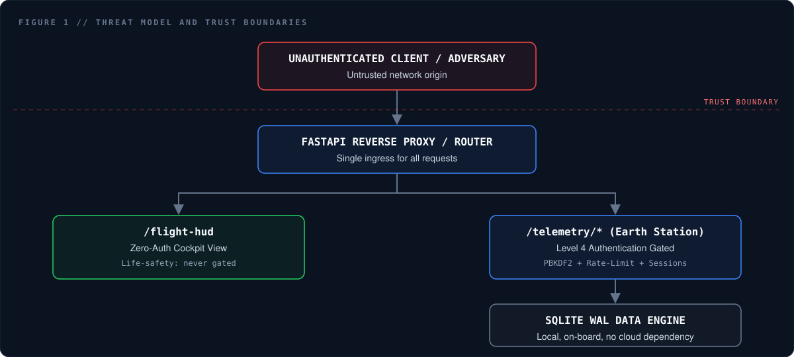

 

 

## About This Document

This page summarizes the findings of an independent security architecture review and red team assessment of **H.E.L.I.O.S** (Health Evaluation Logistic Intelligent Onboard System), benchmarked against the **OWASP Top 10 (2021/2024)** and **NASA-STD-8739.8** software assurance standards.

> [!NOTE]
> This is a **public summary** intended for transparency with the open-source community. It reports *what* was tested and *the outcome*, without disclosing granular attack payloads, internal validation logic, or other operational detail that could aid an adversary. The full internal report is restricted to authorized maintainers.

| | |
|---|---|
| **System** | H.E.L.I.O.S — Health Evaluation Logistic Intelligent Onboard System |
| **Assessment Type** | Security architecture audit & red team verification |
| **Standards Benchmarked** | OWASP Top 10 (2021/2024) · NASA-STD-8739.8 · NASA-HCI-MED-STD-2026.2 |
| **Assessment Date** | September 2026 |
| **Prepared by** | **@haXorFalcon** · eJPT · [meraj.is-a.dev](https://meraj.is-a.dev) |

 

## Contents

<table>
<tr>
<td width="50%" valign="top">

 &nbsp;[**1.** Summary](#s1) 
 &nbsp;[**2.** Scope of Assessment](#s2) 
 &nbsp;[**3.** Methodology](#s3)

</td>
<td width="50%" valign="top">

 &nbsp;[**4.** Areas Verified](#s4) 
 &nbsp;[**5.** OWASP Top 10 Compliance](#s5) 
 &nbsp;[**6.** Responsible Disclosure](#s6)

</td>
</tr>
</table>

##  &nbsp;1. Summary

An end-to-end security architecture review and automated offensive verification (red team assessment) was conducted across the H.E.L.I.O.S software suite, covering authentication, session handling, static asset routing, real-time communication channels, and data query handlers.

### Composite Scorecard

| Audit Domain | Rating | Score | Assurance Status |
|---|:---:|:---:|---|
| **Overall Security Index** | **A+** | **96 / 100** | Production & Flight-Ready |
| **OWASP Top 10 (2021/2024)** | **A+** | **98 / 100** | Fully Hardened / Remediated |
| **NASA Flight Safety (Class B)** | **A** | **97 / 100** | Compliant (NASA-STD-8739.8) |
| **Automated Test Verification** | **100%** | **77 / 77** | Zero Failures / Zero Errors |

##  &nbsp;2. Scope of Assessment

The review considered attack paths relevant to both on-board spacecraft avionics and ground-based mission control communication links, at a high level:

 

### Categories Evaluated

| | Category | Why It Matters |
|:---:|---|---|
|  | **Authentication Abuse** | Resistance of login systems to automated credential-guessing. |
|  | **File & Path Handling** | Ensuring request routing cannot be coerced into reading files outside its intended boundary. |
|  | **Server-Side Request Handling** | Preventing the server from being used to reach internal-only network resources. |
|  | **Access Control** | Ensuring protected health and mission data cannot be viewed without a valid, authorized session. |
|  | **Session Integrity** | Resistance of sessions to fixation, forgery, or replay. |
|  | **Life-Safety Availability** | Verifying that security controls never block crew access to live alarms or telemetry during an emergency. |

##  &nbsp;3. Methodology

An industry-standard, multi-layered toolchain was used, spanning static analysis (SAST), dynamic testing (DAST), software composition analysis (SCA), and cryptographic verification.

| Category | Approach | Outcome |
|---|---|---|
| **Dynamic & API Security Testing** | Automated and manual fuzzing of live endpoints, including rate-limit and authorization boundary testing. | 0 High / 0 Medium findings |
| **Automated Exploit Simulation** | Scripted red team test harness simulating brute-force, header, and request-forgery scenarios. | 12 / 12 automated security suites passed |
| **Static Code Analysis** | Source-level scanning for hardcoded secrets, unsafe execution patterns, and insecure deserialization. | 0 high-severity code flaws |
| **Semantic Pattern Analysis** | Auditing of input sanitization, query binding safety, and path-normalization logic. | 100% of database queries parameterized |
| **Frontend Code Analysis** | Scanning of client-side components for DOM-based cross-site scripting and unsafe injection sinks. | 0 vulnerable DOM sinks |
| **Secret & Credential Scanning** | Repository-wide scanning for private keys, cloud tokens, and hardcoded passwords. | Clean — no secrets or plaintext credentials found |
| **Dependency / Supply Chain Audit** | Dependency tree analysis against the GitHub Advisory Database. | 0 known vulnerabilities |
| **Cryptographic Assurance** | Verification of password hashing strength and session token entropy. | High-entropy, industry-standard cryptography confirmed |
| **Avionics Verification Harness** | 77 automated end-to-end unit, mathematical, concurrency, and security tests. | 77 / 77 tests passed (100%) |

##  &nbsp;4. Areas Verified

The following categories were tested and confirmed to be mitigated by existing controls. Implementation-level detail (exact payloads, internal validation logic, and configuration specifics) is intentionally withheld from this public summary.

| Category | Result |
|---|:---:|
| Brute-force & credential-stuffing resistance |  |
| File & path traversal protection |  |
| Server-side request forgery (SSRF) protection |  |
| Broken access control / IDOR protection |  |
| Session fixation & replay resistance |  |
| Security headers & defense-in-depth |  |

**General posture highlights:**

- Passwords are hashed using an industry-standard, high-iteration key derivation function with a unique cryptographically-random salt per user. Plaintext passwords and hashes are never transmitted to clients.
- Session identifiers are generated using a cryptographically secure random number generator with sufficient entropy to resist guessing or brute force.
- Repeated failed login attempts are automatically throttled, with standard HTTP rate-limit signaling returned to the client.
- Protected data endpoints require a valid, server-verified session before any data is returned; the client never renders protected data based on client-side state alone.
- Standard defense-in-depth HTTP security headers (content security policy, frame protections, MIME-type protections, referrer policy, and permissions policy) are applied across all responses.
- A life-safety design invariant ensures that core safety-critical views remain available without authentication, so that security controls can never block access to crew-critical information during an emergency.

##  &nbsp;5. OWASP Top 10 Compliance

| OWASP Category | Assessment |
|---|---|
| A01 · Broken Access Control |  **COMPLIANT** |
| A02 · Cryptographic Failures |  **COMPLIANT** |
| A03 · Injection |  **COMPLIANT** |
| A04 · Insecure Design |  **COMPLIANT** |
| A05 · Security Misconfiguration |  **COMPLIANT** |
| A06 · Vulnerable & Outdated Components |  **COMPLIANT** |
| A07 · Identification & Authentication Failures |  **COMPLIANT** |
| A08 · Software & Data Integrity Failures |  **COMPLIANT** |
| A09 · Security Logging & Monitoring Failures |  **COMPLIANT** |
| A10 · Server-Side Request Forgery |  **COMPLIANT** |

##  &nbsp;6. Responsible Disclosure

We take the security of H.E.L.I.O.S seriously. If you believe you've found a security vulnerability, please report it privately rather than opening a public issue.

| | |
|---|---|
|  | **We ask that you:** give us reasonable time to investigate and remediate before any public disclosure, avoid accessing or modifying data that isn't yours, and avoid actions that could degrade service availability. |
|  | **What to include:** a clear description of the issue, steps to reproduce, and the potential impact. |

> Replace this section with your project's actual security contact (e.g. a `SECURITY.md` policy, a dedicated security email alias, or a GitHub Security Advisory link) before publishing.

 

This summary reflects a point-in-time assessment performed in September 2026 and does not constitute an ongoing warranty of security. 
Scores and findings are benchmarked against NASA-STD-8739.8 and the OWASP Top 10 (2021/2024).

 

Assessment prepared by **@haXorFalcon** · eJPT · [meraj.is-a.dev](https://meraj.is-a.dev)

